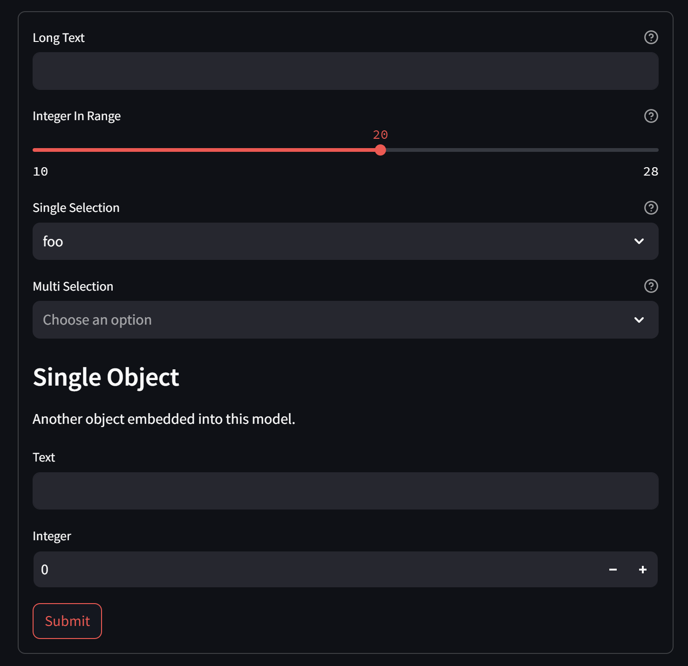

# pydantic-data-creator

A simple tool to create json data for pydantic models.




## Installation

```bash
pip install git+https://github.com/yukikotani231/pydantic-data-creator
```

## Usage

```bash
pydcreator <path_to_py_file> <model_name>
```

## Example

```bash
pydcreator example.models ExampleModel
```
